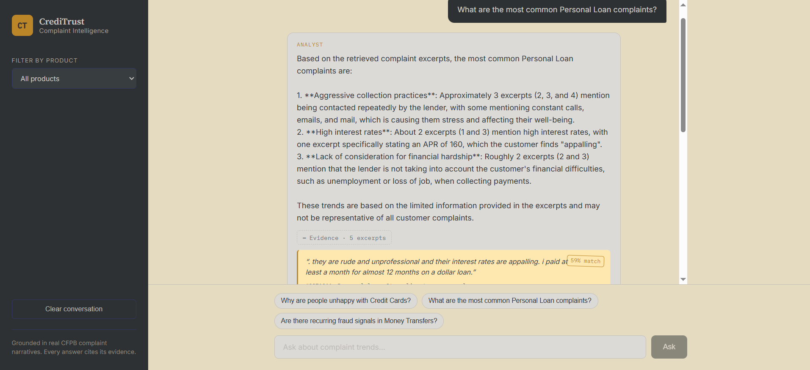

<div align="center">

# 💳 CrediTrust Complaint Intelligence

### A RAG-powered analyst that reads 456,000+ customer complaints so your team doesn't have to

Product Managers were spending days manually reading CFPB complaints to spot emerging
issues. This system collapses that to seconds — ask a plain-English question, get an
answer grounded in real complaint excerpts, with every claim traceable back to its
source. Built for CrediTrust Financial, a digital finance platform serving 500,000+
users across Credit Cards, Personal Loans, Savings Accounts, and Money Transfers.


[Live demo](https://rag-complaint-chatbot.vercel.app/) · [API docs](https://rag-complaint-chatbot.onrender.com/docs) · [How it works](#how-it-works) · [Quick start](#quick-start) · [Architecture](#architecture)

</div>

---

## Demo

**[rag-complaint-chatbot.vercel.app](https://rag-complaint-chatbot.vercel.app/)** — live, working, ask it anything about Credit Card, Personal Loan, Savings Account, or Money Transfer complaints.

> The backend runs on a free-tier instance that spins down after 15 minutes idle —
> the first question after a quiet period may take 30-60 seconds to wake up. That's
> expected, not a bug.


*Every answer streams in live and cites the exact complaint excerpts it's grounded in — click "Evidence" to verify.*

---

## How it works

Most RAG tutorials stop at "embed, retrieve, stuff into a prompt." This one adds the
parts that matter for an internal analyst tool: verifiable evidence, honest
uncertainty, and a deployment that actually survives contact with a free-tier memory
limit.

| Stage | What it does | How |
|---|---|---|
| 🔎 **Retrieve** | Finds the 5 most relevant complaint excerpts | Cosine similarity search over `all-MiniLM-L6-v2` embeddings in ChromaDB, optional product filter |
| 🧠 **Generate** | Writes an analyst-style answer | Groq Llama 3.3 70B, prompted to answer *only* from retrieved context and admit when evidence is thin |
| 📎 **Cite** | Shows its work | Every answer ships with the source excerpts, complaint IDs, and similarity scores it was grounded in |
| ⚡ **Stream** | Feels instant | Server-Sent Events push tokens to the UI as Groq generates them |

## Architecture
## Architecture

```
┌─────────────┐     HTTP/SSE     ┌──────────────┐     similarity search    ┌─────────────┐
│   React UI   │ ───────────────▶ │   FastAPI     │ ─────────────────────▶ │  ChromaDB    │
│  (Vercel)    │ ◀─────────────── │  (Render)     │ ◀───────────────────── │(vector_store)│
└─────────────┘   answer+sources  └──────┬───────┘      top-k chunks       └─────────────┘
                                          │
                              ┌───────────┴────────────┐
                              ▼                         ▼
                       ┌─────────────┐          ┌───────────────┐
                       │  Groq LLM    │          │ HF Inference   │
                       │ Llama 3.3 70B│          │ API (query     │
                       │ (generation) │          │ embedding)     │
                       └─────────────┘          └───────────────┘
```

Bulk indexing (embedding 35,517+ chunks) runs offline, locally, using
`sentence-transformers` — the deployed backend never loads that model at all; it
calls a hosted embedding API for the one short query it needs to embed per question.
See [Engineering decisions](#engineering-decisions-worth-knowing-about) for why..

## Tech stack

**Data pipeline** — Python · pandas (chunked/streaming reads) · LangChain text splitters
**Embeddings** — `sentence-transformers/all-MiniLM-L6-v2` (offline indexing) · Hugging Face Inference API (live queries)
**Vector store** — ChromaDB
**LLM** — Groq · Llama 3.3 70B Versatile
**Backend** — FastAPI · Server-Sent Events · deployed via Docker on Render
**Frontend** — React · Vite · deployed on Vercel

## Quick start

**Requirements:** Python 3.11, Node.js, free API keys from [Groq](https://console.groq.com) and [Hugging Face](https://huggingface.co).

```bash
git clone https://github.com/melat33/Rag-complaint-chatbot.git
cd Rag-complaint-chatbot

python -m venv venv
venv\Scripts\activate          # Windows
pip install -r requirements.txt

copy .env.example .env         # add your GROQ_API_KEY and HF_TOKEN
```

**Run the pipeline:**

```bash
python -m src.data_processing   # Task 1 — EDA + cleaning, streams the full raw CSV
python -m src.build_index       # Task 2 — sample, chunk, embed, index into ChromaDB
python -m src.run_rag_demo      # Task 3 — 10-question evaluation, saved to evaluation/
```

**Start the API and UI:**

```bash
uvicorn backend.main:app --reload --port 8000

cd frontend
npm install
npm run dev
```

Visit `http://localhost:5173`. Full API docs at `http://localhost:8000/docs`.

<details>
<summary>Run tests</summary>

```bash
pytest tests/ -v
```

Mocked LLM/vector store — no network calls or API keys needed.
</details>

## Project structure
## Project structure

```
rag-complaint-chatbot/
├── src/
│   ├── config.py                single source of truth for paths/hyperparameters
│   ├── data_processing.py       Task 1: streaming EDA + cleaning
│   ├── chunking.py              Task 2: stratified sampling + text splitting
│   ├── embedding.py             Task 2: OFFLINE bulk embedding + indexing (local, torch)
│   ├── query_embedding.py       Task 3: LIVE query embedding via HF API (deployed backend)
│   ├── vector_store.py          ChromaDB access, zero heavy ML dependencies
│   ├── retriever.py             Task 3: similarity search
│   ├── generator.py             Task 3: Groq LLM calls, sync + streaming
│   ├── prompt_templates.py      the grounded-only analyst prompt
│   ├── rag_pipeline.py          orchestrates retriever + generator
│   ├── build_index.py           CLI: run Task 2 end-to-end
│   └── run_rag_demo.py          CLI: run Task 3 evaluation end-to-end
├── backend/                   FastAPI: /health, /ask, /ask/stream
├── frontend/                   React chat UI, streaming + evidence panel
├── tests/                      pytest, mocked LLM/vector store
├── notebooks/                   EDA, chunking experiments, RAG demo + evaluation
├── evaluation/eval_questions.md      10-question qualitative evaluation
├── Dockerfile                  deployed backend image (leaner than local dev)
├── requirements.txt             full local dev deps (torch, sentence-transformers)
└── requirements-backend.txt      deployed backend deps (no torch)
```
## Engineering decisions worth knowing about

A few choices in this codebase came from debugging real failures against real
production-scale data, not from following a tutorial:

- **Product filtering by keyword, not exact string.** CFPB renames its product
  categories over time — "Personal loan" became "Payday loan, title loan, personal
  loan, or advance loan" at some point. Exact-match filtering worked fine on a small
  test sample and then silently returned **zero rows** for 3 of 4 target categories
  against the real 9.6M-row dataset. Fixed with substring keyword matching that
  survives future renames.

- **Streaming CSV reads, not `pd.read_csv()`.** The full CFPB export is several GB.
  Loading it whole exhausts memory on a normal laptop, and `nrows=N` truncation
  biases the sample toward whatever the file happens to be sorted by (usually
  most-recent-first, which skews heavily toward low-narrative-consent complaint
  types). Chunked streaming reads solve both problems at once.

- **A shared metadata-flattening function, because two endpoints drifted apart.**
  `/ask/stream` returned differently-shaped source metadata than `/ask`, so complaint
  IDs rendered as a blank `#` in the UI even though retrieval was working correctly.
  The fix wasn't patching the symptom — it was extracting one function both endpoints
  call, so they structurally can't diverge again.

- **Query embedding moved off the deployed server entirely.** The first deploy loaded
  `torch` + `sentence-transformers` + a 384MB ChromaDB index in the same process as
  the API — comfortably over Render's free-tier 512MB limit, crash-looping on every
  request. Rather than just paying for more RAM, bulk indexing stays local (it only
  ever runs once, offline), while the deployed backend calls a hosted embedding API
  for the one short query it needs per question — same underlying model, so retrieval
  quality is unaffected, but the deployed process never loads torch at all. Along the
  way: a plain `pip install torch` pulls in unused CUDA libraries even on a CPU-only
  host — the explicit CPU-only wheel cut real weight from the deploy image too.

## Evaluation

10 representative questions run through the full pipeline, scored for groundedness
and usefulness — full table in [`evaluation/eval_questions.md`](evaluation/eval_questions.md).
Notable result: asked whether complaints recur against a specific company, the system
explicitly declined to name one it wasn't confident about rather than guessing — the
prompt's groundedness constraint working as intended, not a gap in the answer.

## Roadmap

- Tune `top_k` per question type — broad questions likely need more retrieved chunks
  than narrow ones
- Add conversation memory for multi-turn follow-ups
- Cross-encoder reranking on top of initial vector search
- Swap ChromaDB for a managed vector DB for multi-instance deployment

---

**Author:** Melat — AI/ML Engineer 

</div>